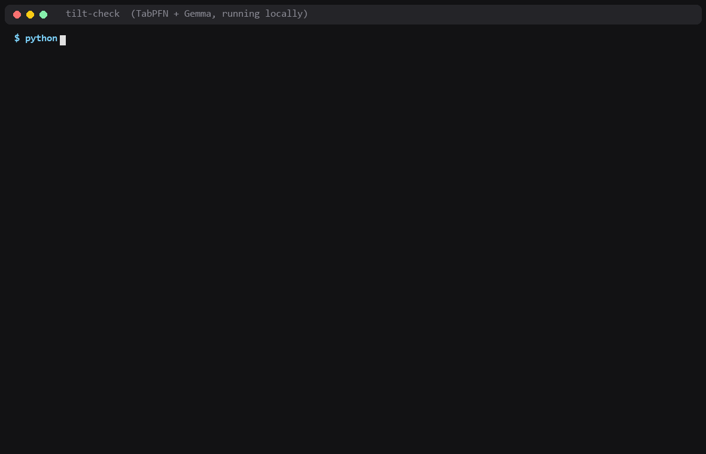

# tilt-check

A pre-trade check for futures traders that learns from your own NinjaTrader history.

[TabPFN](https://github.com/PriorLabs/TabPFN) (open weights) reads your past trades. [Gemma](https://ai.google.dev/gemma) (open weights, through [Ollama](https://ollama.com)) tells you in plain language what your own numbers say about the trade you're about to take. Everything runs on your machine. It never places an order.



I built it for my partner, who trades micro futures (MNQ, MES, MGC) on a prop-firm account and kept asking the same question after a bad session: *is this one of my good trades or one of my bad ones?*

## What it said about her account

Her numbers, shared with her permission. One account, Sep 1 to Oct 2, 2026:

- 293 entries over 23 days, win rate 64.2%, net **+$1,832.87** after commissions. Average win $29.01, average loss $34.49.
- Her **first 5 entries each day**: 92 trades, win rate 55.4%, net **-$327.38**. From the 6th entry on: 201 trades, 68.2%, **+$2,160.25**.
- By New York session: the regular session (9:30 a.m. to 4 p.m.) made +$1,175.46 over 185 trades, but almost none of it in the morning. **9:30 to noon: 71 trades, +$8.11.** Noon to 4 p.m.: 114 trades, 64.9%, +$1,167.35.
- **11 p.m. to 2 a.m. in New York** (noon to 3 p.m. in Korea): 17 trades, win rate 47.1%, net **-$306.01**. Before the New York open (5 to 9:30 a.m.): 36 trades, 77.8%, +$499.23.
- And the part I didn't expect: TabPFN **can't tell her winners from her losers**. Trained on older trades and scored on newer ones it had never seen, it got AUC 0.42, 0.52, 0.48 and 0.55 on four walk-forward blocks (0.50 is a coin flip). So the check says that out loud instead of showing a confident percentage.

## The bug that almost became the headline

My first version said she falls apart after a losing trade: 74% win rate after a win, 50% after a loss. It was a great story and it was wrong.

NinjaTrader writes one row per exit, so a scaled-out entry becomes several rows, and her trades overlap. Computing "was the previous trade a loss?" from the previous *row* let a trade peek at a result that hadn't happened yet. Once every feature is computed only from trades that had **already closed** when she clicked, the gap disappears: right after a loss she won 65.2% (92 trades, +$1,217.08). There's a test for this now (`test_no_look_ahead_on_overlapping_trades`).

## Time is New York time

NinjaTrader exports use the PC's clock. On a Korean PC, a window like "12:00-14:59" is easy to read as the New York session, but it's actually 11 p.m. to 2 a.m. in New York. So every time window tilt-check prints is a New York session (NY open, NY afternoon, before the NY open, Europe open, NY overnight, after the NY close) with the PC hours next to it, and daylight saving is handled. Set `TILTCHECK_TZ` (for example `Asia/Seoul` or `America/Chicago`) if your PC's zone observes daylight saving and you're importing trades from both sides of the switch.

## What a check looks like

```text
$ python -m tiltcheck check "short 2 MNQ" --at "2026-10-02 13:05"   # replaying a real moment

Plan: short 2 MNQ at 13h Fri (NY overnight), 5 loss(es) in a row before, 0 trade(s) earlier today, today P&L $0, 1334 min since last exit

What your own history says about trades like this:
- trade #1 of the day (your first 5 trades each day): 91 trades, win rate 54.9%, net $-353.04
- right after a losing trade: 90 trades, win rate 64.4%, net $1,179.90
- after 2+ losses in a row: 37 trades, win rate 62.2%, net $533.82
- bigger size than usual: 26 trades, win rate 61.5%, net $816.31
- NY overnight 23:00-02:00 New York (12:00-15:00 on this PC): 17 trades, win rate 47.1%, net $-306.01
- MNQ short: 128 trades, win rate 61.7%, net $182.20

Model check: on trades it had not seen, TabPFN scored AUC 0.50 (0.50 = coin flip). Your history can't tell winners from losers yet, so the 65% below is shown for the log only.
TabPFN chance this ends green: 65% (your usual: 64%)
Closest past trades:
- 09-15 02:21 (NY afternoon) short 1 MNQ: won $3.96 (trade #1 that day)
- 10-01 14:29 (NY overnight) short 1 MNQ: lost $-29.54 (trade #13 that day)
- 10-01 14:19 (NY overnight) short 1 MNQ: lost $-96.04 (trade #12 that day)
- 09-17 23:35 (NY open) short 1 MNQ: won $48.46 (trade #6 that day)
- 09-05 02:14 (NY afternoon) short 1 MNQ: won $5.96 (trade #13 that day)

The NY overnight 23:00-02:00 New York group has a 47.1% win rate, compared to your overall 64%.
The right after a losing trade group shows a 64.4% win rate with a net of $1,179.90.
Given you have 5 loss(es) in a row, how does that influence your sizing for this trade?

take / skip / wait?  skip
why (one line)?  first trade of the day, lunch window
```

Every check is logged with her decision and reason. `learn` imports the next export, adds the new trades to the history TabPFN reads (there's no training run, it's in-context, so new trades count on the very next check), and matches each logged decision to the trade that followed, so she can see whether skipping paid off.

## Where to close

`exits` looks at how she closes trades. Part of that is already in the export. On MNQ her winners close at a median **+7.88 points after 4.7 minutes**, and her losers at **-11.75 points after 7.4 minutes**. She takes profits faster than she takes losses.

The other part is "where should a trade like this be closed", and that needs to know where price went while she was in it. Her prop-account export can't say: NinjaTrader's MAE and MFE columns there just repeat the final P&L (on 99.7% of rows). So `exits --bars` takes minute bars exported from NinjaTrader (Control Center > New > Historical Data > Export, Minute) and replays every entry with fixed brackets: a target and a stop, in multiples of her usual move. It works out the bars' clock from her fills, picks the best bracket on her older 70% of trades, then scores it on the newer 30% against what her own exits made. The rules lean pessimistic: a bar that touches both the stop and the target counts as the stop.

```bash
python -m tiltcheck exits --csv trades.csv --bars "MNQ 09-26.Last.txt" "MNQ 12-26.Last.txt"
```

## Install

```bash
python -m venv .venv && .venv/bin/pip install -r requirements.txt   # Windows: .venv\Scripts\pip
# GPU is optional; TabPFN runs on CPU for a few hundred trades.
ollama pull gemma4:e4b       # or gemma4:e2b on smaller GPUs
```

Export from NinjaTrader: Control Center > Trade Performance > Trades tab > right-click > Export. English and Korean column names both work.

## Use

```bash
python -m tiltcheck report --csv trades.csv [--account 0014] [--lang ko]
python -m tiltcheck check "short 2 MNQ right after a stop" --csv trades.csv
python -m tiltcheck learn --csv next_export.csv
python -m tiltcheck exits --csv trades.csv [--bars bars_folder/]
```

Try it without your own data: `python -m tiltcheck report --csv sample/trades_sample.csv` (made-up trades with a slow-start pattern baked in).

## What stays where

- Your CSV, the merged history and the decision log live in `~/.tilt-check/`.
- Gemma runs through your local Ollama. TabPFN runs in-process. No API keys, nothing uploaded.

## What it is not

It doesn't predict markets, tell you what to buy or sell, or place orders. It describes your own history. Not financial advice.

## Licenses

Code: MIT. Built with TabPFN: the v2 classifier weights are under the Prior Labs License (Apache 2.0 with an attribution clause). Gemma is under the Gemma Terms of Use.
